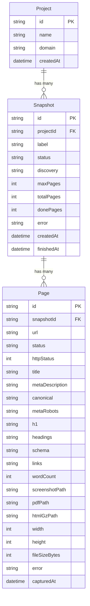
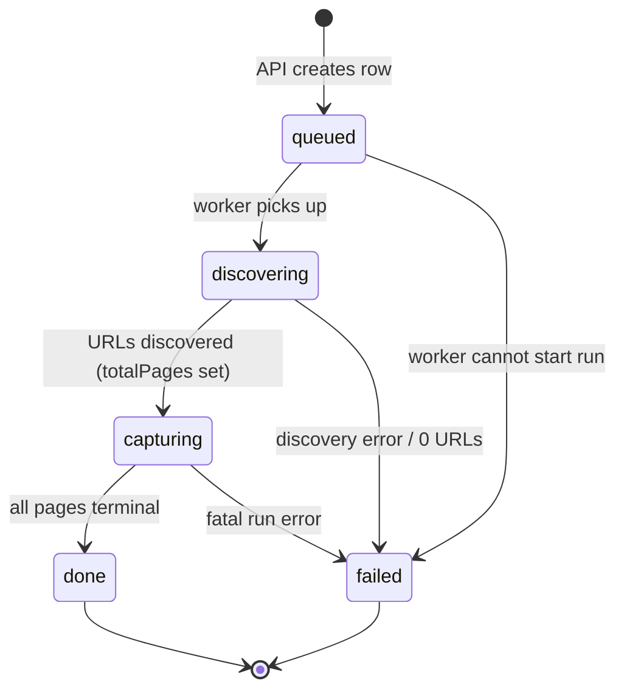
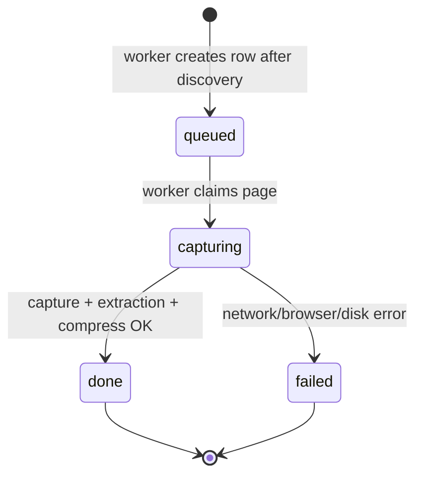

# 06 · Data Model & Storage

> Status: **built** (Phase 2 schema + `src/lib/db.ts`) with **planned** notes for Postgres scale-out.
> Last updated: 2026-06-23.

This document is the **spine** of the data layer. The Prisma schema reproduced below is authoritative — if code and
this doc disagree, fix the doc. It defines the three persisted models (`Project`, `Snapshot`, `Page`), the status state
machines, the JSON-in-string conventions for SQLite, the on-disk archive layout, and the SQLite→Postgres migration path.

Related docs:

- [Architecture](./03-architecture.md) — the API-writes-queued-row / worker-polls split that this schema enables.
- [Capture pipeline](./07-capture-pipeline.md) *(planned)* — who writes which `Page` columns and when.
- [Folder structure](./04-folder-structure.md) — `paths.ts` responsibilities and the archive tree.

---

## 1. ER overview

Three tables, two one-to-many relations, all local in SQLite (`data/app.db`).

```
Project ──< Snapshot ──< Page
  1            1            *
```

- A **Project** is one client domain the agency archives over time. It owns many **Snapshots**.
- A **Snapshot** is one archival run of that domain at a point in time (e.g. "pre-redesign 2026-06-23"). It owns many
  **Pages**.
- A **Page** is one captured URL within a snapshot: its HTTP status, extracted SEO fields, and pointers to the
  screenshot / PDF / gzipped HTML on disk.



The relational keys (`Project.id`, `Snapshot.projectId`, `Page.snapshotId`) live in SQLite. The heavy artifacts
(`.webp`, `.pdf`, `.html.gz`) live on disk under `data/archive`, referenced by **relative** path columns on `Page`
(see [§7](#7-on-disk-storage-layout)). The database stays small and fast; the disk holds the bytes.

---

## 2. Authoritative Prisma schema

This is the exact schema. `Page` JSON columns are stored as `String?` under SQLite (see [§5](#5-json-in-string-under-sqlite)).

```prisma
// prisma/schema.prisma

datasource db {
  provider = "sqlite"
  url      = env("DATABASE_URL") // "file:./data/app.db"
}

generator client {
  provider = "prisma-client-js"
}

model Project {
  id        String     @id @default(cuid())
  name      String
  domain    String
  createdAt DateTime   @default(now())
  snapshots Snapshot[]
}

model Snapshot {
  id         String    @id @default(cuid())
  projectId  String
  project    Project   @relation(fields: [projectId], references: [id])
  label      String?
  status     String    @default("queued") // queued|discovering|capturing|done|failed
  discovery  String    @default("sitemap") // sitemap|crawl
  maxPages   Int       @default(200)
  totalPages Int       @default(0)
  donePages  Int       @default(0)
  error      String?
  createdAt  DateTime  @default(now())
  finishedAt DateTime?
  pages      Page[]
}

model Page {
  id              String    @id @default(cuid())
  snapshotId      String
  snapshot        Snapshot  @relation(fields: [snapshotId], references: [id])
  url             String
  status          String    @default("queued") // queued|capturing|done|failed
  httpStatus      Int?
  title           String?
  metaDescription String?
  canonical       String?
  metaRobots      String?
  h1              String?
  headings        String?   // JSON {h1:[],h2:[],h3:[],h4:[],h5:[],h6:[]}
  schema          String?   // JSON array of JSON-LD blocks
  links           String?   // JSON [{href,anchor,internal}]
  wordCount       Int?
  screenshotPath  String?   // relative .webp under data/archive
  pdfPath         String?   // relative .pdf under data/archive
  htmlGzPath      String?   // relative .html.gz under data/archive
  width           Int?
  height          Int?
  fileSizeBytes   Int?
  error           String?
  capturedAt      DateTime?

  @@index([snapshotId])
  @@unique([snapshotId, url])
}
```

> Set the connection string in `.env`, never in code:
> ```
> DATABASE_URL="file:./data/app.db"
> ```

---

## 3. Model rationale & non-obvious fields

### Project

| Field | Why |
| --- | --- |
| `id` (cuid) | Collision-resistant, sortable-ish, URL-safe. Used in the on-disk path `archive/<projectId>/...`. |
| `name` | Human label shown in the UI (e.g. "Acme Corp"). |
| `domain` | The root domain the snapshot crawls from. Drives discovery + the internal/external link classification. |
| `createdAt` | Audit / sort. |

### Snapshot

| Field | Why |
| --- | --- |
| `label?` | Optional human note for the run ("pre-redesign", "post-launch QA"). Nullable — the UI can default it. |
| `status` | The run-level state machine ([§4](#4-status-state-machines)). Drives UI polling and worker pickup. |
| `discovery` | `sitemap` (default, preferred) or `crawl` (fallback). Records *how* URLs were found, for later audit. |
| `maxPages` (200) | Hard cap on URLs captured in one run — protects disk and runtime on large sites. |
| `totalPages` | Set by the worker after discovery completes: how many URLs will be captured. Denominator for progress. |
| `donePages` | Incremented by the worker as each `Page` reaches a terminal state. Numerator for progress (`donePages/totalPages`). |
| `error?` | Run-level failure reason (e.g. discovery found zero URLs). Set only on `status=failed`. |
| `finishedAt?` | Stamped when the run reaches `done` or `failed`. Null while in flight. |

`totalPages` / `donePages` are intentionally **denormalized counters** so the UI's TanStack Query poll can render a
progress bar from a single cheap `Snapshot` read, without a `COUNT(*)` over `Page` on every poll.

### Page

| Field | Why |
| --- | --- |
| `url` | The captured page URL. Unique within a snapshot (see [§6](#6-indexes--uniqueness)). |
| `status` | The page-level state machine ([§4](#4-status-state-machines)). |
| `httpStatus?` | Response status (200/301/404/…). Nullable until captured; a non-200 is still a valid archived fact. |
| `title`, `metaDescription`, `canonical`, `metaRobots`, `h1` | Single-value SEO fields, extracted in-page. Nullable — many pages legitimately lack them, and that absence is itself evidence worth archiving. |
| `headings` | JSON `{h1:[],h2:[],...,h6:[]}` — full heading outline ([§5](#5-json-in-string-under-sqlite)). `h1` is duplicated as a scalar for cheap listing/sorting. |
| `schema` | JSON array of the page's JSON-LD blocks (raw, as parsed). |
| `links` | JSON array `[{href, anchor, internal}]` — every on-page link with its anchor text and an internal/external flag (computed against `Project.domain`). |
| `wordCount?` | Visible-text word count — a coarse "was there content here" signal for redesign disputes. |
| `screenshotPath?` | **Relative** path to the `.webp` full-page screenshot ([§7](#7-on-disk-storage-layout)). |
| `pdfPath?` | **Relative** path to the optional exported `.pdf`. |
| `htmlGzPath?` | **Relative** path to the gzipped raw HTML — the source-of-truth artifact behind every extracted field. |
| `width`, `height` | Screenshot pixel dimensions (full-page height varies wildly per URL). |
| `fileSizeBytes?` | Final WebP size — lets us assert the "under 5 MB" guarantee per page and surface outliers. |
| `error?` | Per-page failure reason; set only on `status=failed`. A failed page never blocks the rest of the run. |
| `capturedAt?` | Stamped when the page reaches a terminal state. |

---

## 4. Status state machines

Two independent string status fields. **The API only ever writes the initial `queued` state. The worker owns every
transition after that.** This is the contract that keeps the API non-blocking and the worker the single source of heavy
work (see [Architecture](./03-architecture.md)).

### Snapshot status



Legal Snapshot transitions:

| From | To | Who | Trigger |
| --- | --- | --- | --- |
| *(none)* | `queued` | **API** | `POST` creates the row and returns immediately. |
| `queued` | `discovering` | worker | Worker claims the oldest `queued` snapshot and starts URL discovery. |
| `discovering` | `capturing` | worker | Discovery succeeded; `totalPages` written; per-`Page` rows created `queued`. |
| `discovering` | `failed` | worker | No URLs found, sitemap+crawl both failed, etc.; `error` + `finishedAt` set. |
| `capturing` | `done` | worker | Every `Page` is `done` or `failed`; `finishedAt` set. |
| `capturing` | `failed` | worker | Unrecoverable run-level error; `error` + `finishedAt` set. |
| `queued` | `failed` | worker | Worker cannot even begin (bad config, etc.). |

- `done` and `failed` are **terminal**. Nothing transitions out of them. A re-run is a **new** Snapshot row, never a
  mutation of an old one — that preserves the archival history.
- A snapshot reaches `done` even if some pages `failed`; partial archives are still valuable. Run-level `failed` is
  reserved for failures that prevent capturing *anything* meaningful.

### Page status



Legal Page transitions:

| From | To | Who | Trigger |
| --- | --- | --- | --- |
| *(none)* | `queued` | worker | Created during `discovering→capturing` for each discovered URL. |
| `queued` | `capturing` | worker | A `p-queue` slot opens and the page is claimed. |
| `capturing` | `done` | worker | Playwright capture, in-page extraction, and WebP compression all succeeded; artifact paths + `capturedAt` written. |
| `capturing` | `failed` | worker | Any external op (navigation, screenshot, sharp, disk write) threw; `error` + `capturedAt` set. |

- Pages are **never created by the API** — only the worker, after discovery, writes them. This keeps `@@unique`
  enforcement in one writer.
- On every terminal Page transition the worker increments `Snapshot.donePages`. When `donePages == totalPages`, the
  worker flips the Snapshot to `done`.

> **Note on enums:** `status` and `discovery` are `String` (not Prisma `enum`) because SQLite has no native enum type.
> The legal values are enforced in application code via **zod** at the API/worker boundary, and documented in the
> schema comments above. On Postgres these become real `enum`s with no app-logic change (see [§8](#8-sqlitepostgres-migration-checklist)).

---

## 5. JSON-in-string under SQLite

`Page.headings`, `Page.schema`, and `Page.links` are naturally **arrays / nested objects**. SQLite has no native array
or JSON column type that Prisma can map to a typed field, so we store them as `String?` containing
`JSON.stringify(...)` payloads and `JSON.parse(...)` on read.

Shapes (the contract callers rely on):

```ts
// headings
{ h1: string[]; h2: string[]; h3: string[]; h4: string[]; h5: string[]; h6: string[] }

// schema
Array<Record<string, unknown>>   // raw JSON-LD blocks, as parsed from the page

// links
Array<{ href: string; anchor: string; internal: boolean }>
```

Rules:

- **Always** go through a single serialize/parse helper (validated with zod on read), never ad-hoc `JSON.parse` at call
  sites — so a malformed payload fails loudly in one place, not silently across the UI.
- Treat these columns as opaque blobs in SQL: do **not** try to filter/sort on their contents under SQLite. If we ever
  need to query "all pages whose JSON-LD has `@type=Product`", that is the trigger to move to Postgres.

### The painless switch to native `Json` on Postgres

On Postgres, Prisma supports a native `Json` type backed by `jsonb`. The migration is **column-type-only**:

```prisma
// Postgres variant — same fields, native Json
headings Json?
schema   Json?
links    Json?
```

Because the in-app shapes are already fixed and validated, the change is: swap `String?`→`Json?` for these three
fields, drop the `JSON.stringify/parse` indirection at the boundary, and gain `jsonb` indexing / containment queries
(`@>`) for free. No call-site rewrites beyond removing the manual (de)serialization. This is why we keep all
serialization in one helper today — that helper is the only thing that gets deleted.

---

## 6. Indexes & uniqueness

```prisma
@@index([snapshotId])
@@unique([snapshotId, url])
```

### `@@unique([snapshotId, url])`

- **Prevents duplicate captures of the same URL within one run.** Sitemaps frequently list the same URL twice, and
  crawl fallback can rediscover a URL via multiple in-page links. Without this, we'd waste a Playwright capture and
  store two copies of the same page.
- It is **scoped to the snapshot**, not global: the *same* URL **should** appear once per snapshot over time — that's
  the whole point of archiving a domain repeatedly. Uniqueness on `url` alone would break re-runs.
- Operationally, the worker uses this as an idempotency guard: discovery can `upsert` / `createMany … skipDuplicates`
  on `(snapshotId, url)` and the database enforces no-double-insert, even under concurrent discovery writes.

### `@@index([snapshotId])`

- Every hot read is "give me the pages for this snapshot" — the UI page list, progress aggregation, and PDF export all
  filter by `snapshotId`. The index makes those `WHERE snapshotId = ?` scans cheap as snapshots grow to the 200-page cap.
- The `@@unique([snapshotId, url])` composite *also* covers `snapshotId`-prefixed lookups, but the explicit single-column
  index keeps intent clear and is harmless; on Postgres we'd reassess whether the composite alone suffices.

---

## 7. On-disk storage layout

Heavy artifacts live on local disk under `data/archive`, **never** in the database. The DB stores only **relative**
path strings. Paths are produced exclusively by `src/lib/paths.ts` so naming is centralized and testable.

### `paths.ts` contract

```ts
DATA_DIR                                  // absolute, from env or default ./data
ARCHIVE_DIR                               // <DATA_DIR>/archive
snapshotDir(projectId, snapshotId)        // <ARCHIVE_DIR>/<projectId>/<snapshotId>  (created if missing)
pageAssetPath(projectId, snapshotId, pageId, ext)  // file path for one page's asset
```

`paths.ts` **creates directories if missing** (mkdir recursive) and the asset helpers return paths whose parent is
guaranteed to exist before the worker writes bytes.

### Directory tree

```
data/
  app.db                                  # SQLite (gitignored)
  archive/                                # all artifacts (gitignored)
    <projectId>/
      <snapshotId>/
        <pageId>.webp                     # full-page screenshot, WebP, < 5 MB
        <pageId>.pdf                       # optional PDF export
        <pageId>.html.gz                   # gzipped raw HTML (source of truth)
```

### File naming

| Artifact | Name | DB column |
| --- | --- | --- |
| Screenshot | `<pageId>.webp` | `Page.screenshotPath` |
| PDF (optional) | `<pageId>.pdf` | `Page.pdfPath` |
| Raw HTML (gzipped) | `<pageId>.html.gz` | `Page.htmlGzPath` |

Using the opaque `pageId` (a cuid) as the filename — rather than a slugified URL — avoids filesystem-illegal characters,
length limits, and collisions between URLs that slugify identically. The human-readable URL stays in `Page.url`.

### Why path columns store RELATIVE paths

The columns store paths **relative to `ARCHIVE_DIR`** (e.g. `ayz.../bcd.../efg....webp`), not absolute paths.

- **Portability.** The archive directory can be copied, moved, mounted at a different absolute location, or zipped and
  handed to a client without rewriting the database. Absolute paths (`/Users/kalraj/BuildRight/data/archive/...`) would
  hard-bind every row to one machine's filesystem layout.
- **Cloud-shape readiness.** When `disk → S3`, the same relative string becomes the **object key** under a bucket
  prefix with no schema or data migration. This mirrors the swap-not-rewrite goal of the whole architecture.
- **Resolution** is always `path.join(ARCHIVE_DIR, row.screenshotPath)` at read time, with `ARCHIVE_DIR` coming from
  env/`paths.ts` — one place to repoint storage.

---

## 8. SQLite → Postgres migration checklist

The schema is deliberately Postgres-ready. When the agency outgrows local-first, this is the path. Nothing in the
archive is thrown away.

- [ ] **Datasource.** Change `provider = "sqlite"` → `"postgresql"`; set `DATABASE_URL` to the Postgres connection
      string in `.env` (still no secrets in code).
- [ ] **JSON columns.** Change `headings`, `schema`, `links` from `String?` → `Json?`; delete the `JSON.stringify/parse`
      helper indirection (see [§5](#5-json-in-string-under-sqlite)).
- [ ] **Status / discovery fields.** Optionally promote `Snapshot.status`, `Snapshot.discovery`, and `Page.status` from
      `String` to Prisma `enum`s; the zod-enforced legal values already match the enum members.
- [ ] **Indexes.** Re-evaluate whether `@@index([snapshotId])` is redundant given `@@unique([snapshotId, url])`; add
      `jsonb` GIN indexes only if/when we query JSON contents.
- [ ] **Migrations.** Switch from `prisma db push` (dev/SQLite) to `prisma migrate` with a real migration history before
      production Postgres.
- [ ] **Data backfill.** Export existing SQLite rows; for JSON columns, `JSON.parse` the stored strings into real `jsonb`
      on insert. The `(snapshotId, url)` uniqueness carries over unchanged.
- [ ] **Storage.** Move `data/archive` contents to S3 (or keep on a mounted volume); relative path columns become object
      keys with no row edits (see [§7](#7-on-disk-storage-layout)).
- [ ] **Verify.** `prisma validate`, then `prisma studio` against Postgres; confirm a sample Snapshot's pages resolve
      their artifacts and JSON fields parse.

---

## 9. The `src/lib/db.ts` singleton

Prisma's `PrismaClient` opens a connection pool. In Next.js dev, hot-reload re-imports modules on every change; a naive
`new PrismaClient()` at module scope would spawn a **new client (and pool) on every reload**, eventually exhausting
SQLite file handles / Postgres connections and emitting "too many clients" warnings. The guard caches one client on
`globalThis` across reloads.

```ts
// src/lib/db.ts
import { PrismaClient } from "@prisma/client";

const globalForPrisma = globalThis as unknown as { prisma?: PrismaClient };
// ^ cast required: globalThis has no `prisma` in its type. Localized, commented per Phase 0.

export const db =
  globalForPrisma.prisma ?? new PrismaClient();

if (process.env.NODE_ENV !== "production") {
  globalForPrisma.prisma = db;
}
```

- In **production** we do not attach to `globalThis` — the process starts once, so a fresh client per process is correct
  and avoids leaking a long-lived global.
- Both the API and the **worker** import this same `db` so there is exactly one client per process.

---

## 10. Planned schema additions (Phase 12)

The Phase 2 schema above is the built spine. One model is **added later, in Phase 12**, and must not be built ahead
([Conventions §8](./05-conventions.md)):

- **Worker heartbeat** — a small row the worker updates on a timer so `/api/health` and the UI can warn "worker not
  running" if there's no heartbeat in ~30s. Shape is decided in [Phase 12](./phases/phase-12-hardening-and-scale.md)
  (e.g. a single-row `WorkerHeartbeat { id, lastBeatAt }` or equivalent).

Two other Phase 12 items need **no** schema change: the "re-run failed pages" action re-queues existing `Page` rows
(`failed → queued`), and the per-snapshot **capture log** is derived from existing `Page.status` / `Page.error`.

## How to verify (Phase 2)

```bash
npm run db:push     # prisma db push — applies schema to data/app.db
npm run db:studio   # prisma studio — inspect Project/Snapshot/Page tables
```

- [ ] `data/app.db` is created and gitignored.
- [ ] Prisma Studio shows the three models with the fields above.
- [ ] Importing `db` from `@/lib/db` in both an API route and the worker yields one client each (no hot-reload warnings).
